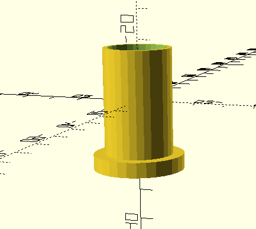
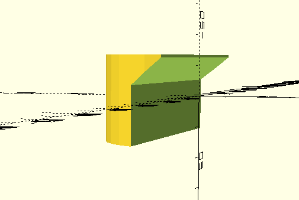
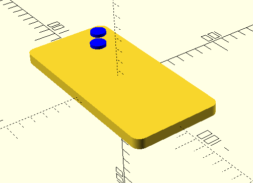

**Работа Иванов Савелий**

Проект «Цифровой окуляр микроскопа» на языке OpenScad

Модель для 3D-печати универсального захвата и окуляра для школьного микроскопа ШМ-1, которые закрепляются на тубусе микроскопа. Захват позволяет совместить оптическую ось объектива камеры смартфона с оптической осью окуляра микроскопа.

Исходная модель захвата: Модель в форматах STL и UPP в репозитории на GitHub. Universal Phone Microscope Adapter.

**Окуляр**

**Боковой держатель**

**Модель смартфона iPhone 15**

